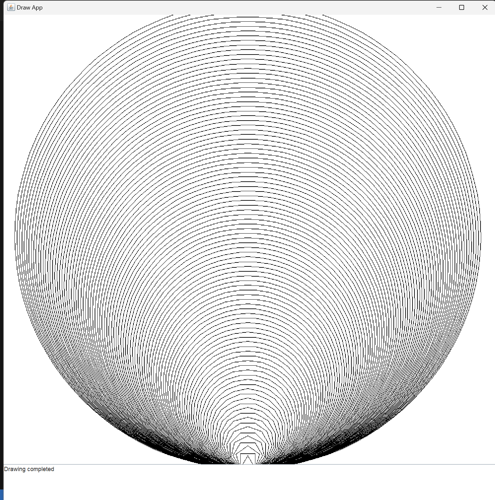

Introduction: Hello, I am Zhou and welcome to this tutorial for Drawapp-4.0. To get start, just open the files in order and read the comments. The lesson includes drawing animation and polygon where detailed comments is attached. You will be able to start doing your coursework after learning all this files.

Description: The file starts from number are the main files. The files ended with ".h" are header file which I will guide you through in the main files. Be careful with the file including "graphics". You may not be able to compile the program without these files.

Expectation: You will be able to make animation which is needed in the coursework and draw complex polygon easily with the help of abstraction like this 